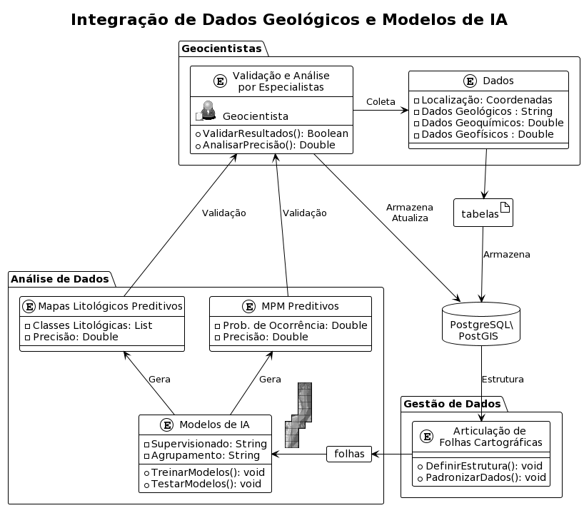

# Preditor Terra

## Sobre o Projeto

Projeto que visa a produção de um sistema dinâmico de produção de mapas
preditivos, no qual, ao se disponibilizar novos dados, novas predições serão
geradas.



## Por que usar uma base de dados relacional?

### Testando a performance de consultas espaciais
```
geodatabase=# 
EXPLAIN ANALYZE
SELECT * FROM folhas_cartograficas
WHERE ST_Intersects(wkb_geometry, ST_MakeEnvelope(-48.234, -10.939, -47.850, -10.469, 4326));
                                                                                                                      QUERY PLAN

---------------------------------------------------------------------------------------------------------------------------------------------------------------------------------
----------------------------------------------------------------------
 Bitmap Heap Scan on folhas_cartograficas  (cost=4.40..248.03 rows=15 width=146) (actual time=0.298..0.498 rows=96 loops=1)
   Filter: st_intersects(wkb_geometry, '0103000020E61000000100000005000000CBA145B6F31D48C054E3A59BC4E025C0CBA145B6F31D48C0E3A59BC420F024C0CDCCCCCCCCEC47C0E3A59BC420F024C0CDCCCCC
CCCEC47C054E3A59BC4E025C0CBA145B6F31D48C054E3A59BC4E025C0'::geometry)
   Heap Blocks: exact=45
   ->  Bitmap Index Scan on ix_folhas_cartograficas_geom  (cost=0.00..4.39 rows=15 width=0) (actual time=0.208..0.208 rows=96 loops=1)
         Index Cond: (wkb_geometry && '0103000020E61000000100000005000000CBA145B6F31D48C054E3A59BC4E025C0CBA145B6F31D48C0E3A59BC420F024C0CDCCCCCCCCEC47C0E3A59BC420F024C0CDCCCCCC
CCEC47C054E3A59BC4E025C0CBA145B6F31D48C054E3A59BC4E025C0'::geometry)
 Planning Time: 0.741 ms
 Execution Time: 0.530 ms
(7 linhas)
```

### Desabilitando os índices espaciais para testar a performance

```
geodatabase=#
SET enable_seqscan TO OFF;
SET enable_indexscan TO OFF;
SET enable_bitmapscan TO OFF;

EXPLAIN ANALYZE
SELECT * FROM folhas_cartograficas
WHERE ST_Intersects(wkb_geometry, ST_MakeEnvelope(-48.234, -10.939, -47.850, -10.469, 4326));

---------------------------------------------------------------------------------------------------------------------------------------------------------------------------------
----------------------------------------------------------------------
 Bitmap Heap Scan on folhas_cartograficas  (cost=10000000004.40..10000000248.03 rows=15 width=146) (actual time=43.543..43.663 rows=96 loops=1)
   Filter: st_intersects(wkb_geometry, '0103000020E61000000100000005000000CBA145B6F31D48C054E3A59BC4E025C0CBA145B6F31D48C0E3A59BC420F024C0CDCCCCCCCCEC47C0E3A59BC420F024C0CDCCCCC
CCCEC47C054E3A59BC4E025C0CBA145B6F31D48C054E3A59BC4E025C0'::geometry)
   Heap Blocks: exact=45
   ->  Bitmap Index Scan on ix_folhas_cartograficas_geom  (cost=0.00..4.39 rows=15 width=0) (actual time=0.123..0.124 rows=96 loops=1)
         Index Cond: (wkb_geometry && '0103000020E61000000100000005000000CBA145B6F31D48C054E3A59BC4E025C0CBA145B6F31D48C0E3A59BC420F024C0CDCCCCCCCCEC47C0E3A59BC420F024C0CDCCCCCC
CCEC47C054E3A59BC4E025C0CBA145B6F31D48C054E3A59BC4E025C0'::geometry)
 Planning Time: 0.187 ms
 JIT:
   Functions: 2
   Options: Inlining true, Optimization true, Expressions true, Deforming true
   Timing: Generation 0.084 ms, Inlining 33.757 ms, Optimization 5.128 ms, Emission 4.506 ms, Total 43.475 ms
 Execution Time: 62.021 ms
(11 linhas)
```

## Estrutura do Repositório
O Repositório está estruturado em 4 caminhos principais:

```
~/projetos/PreditorTerra/..
+-- docs
+-- dotfiles
+-- jupyternotebooks
+-- source
+-- install.sh
+-- README.md
```

- [docs](https://github.com/Gabriel-Goes/mapeamento_litologico_preditivo/tree/main/docs) -- Documentos que fornecem informações sobre o projeto, assim
como relatórios de pesquisa, resumos e pôsters de eventos.
- [dotfiles](https://github.com/Gabriel-Goes/mapeamento_litologico_preditivo/tree/main/dotfiles) --  Arquivos de configuração do ambiente de programação, como
o environment.yml que serve para configurar o ambiente virutal do python com
conda, e o arquivo requirements.txt para configurar o ambieten virtual com
pyenv diretamente. (~~Recomendável~~)
- [jupyternotebooks](https://github.com/Gabriel-Goes/mapeamento_litologico_preditivo/tree/main/jupyternotebooks) -- Scripts de tutoriais e teste de código.
- [source](https://github.com/Gabriel-Goes/mapeamento_litologico_preditivo/tree/main/source) -- Código fonte do programa Preditor Terra.

## Instalação
Siga os passos abaixo para criar um diretório e clonar o repostiório do git.
```bash
# Crie uma pasta para nosso projeto para garantir organização
mkdir -p $HOME/projetos/PreditorTerra
cd $HOME/projetos/PreditorTerra

# Clone o repositório e siga para o diretório
git clone https://github.com/Gabriel-Goes/mapeamento-litologico-preditivo.git PreditorTerra
cd PreditorTerra
```
Execute o script [intsll.sh](https://github.com/Gabriel-Goes/mapeamento-litologico-preditivo/tree/main/install.sh)
para criar um ambiente virtual com [venv](https://docs.python.org/3/library/venv.html).  
```
# Habilitando modo execução do arquivo
chmod +x ./install.sh
./install.sh
```
<span style="font-size:smaller;">_Este processo deve ser facilitando no futuro utilizando [docker]()_</span>
<span style="font-size:smaller;">_Ou refatorando a interface de TKinter para PyQT e adicioanndo ao QGIS como um plugin_</span>


## Uso
```
./PreditorTerra
```

## Autor
Gabriel Góes

## Licença
Este projeto é licenciado sob a GPL - veja o arquivo 'LICENÇA' para detalhes.

## Contato
Para mais informações, entre em contato pelo correio eletrônico gabrielgoes@usp.br

## Contribuições

Para Contribuir com este projeto basta enviar um pull request.
Será adicionado neste arquivo uma lista de frentes a serem desenvolvidas e necessitam de contribuição.

#### Contribuições de:

 - Hilo Góes

#### Apoio de:
 - Dr. Caetano Juliani
 - Victor S. Silva
 - Luiz Dutra
 - Rodrigo Brust
 - Vinicius A. Louro
