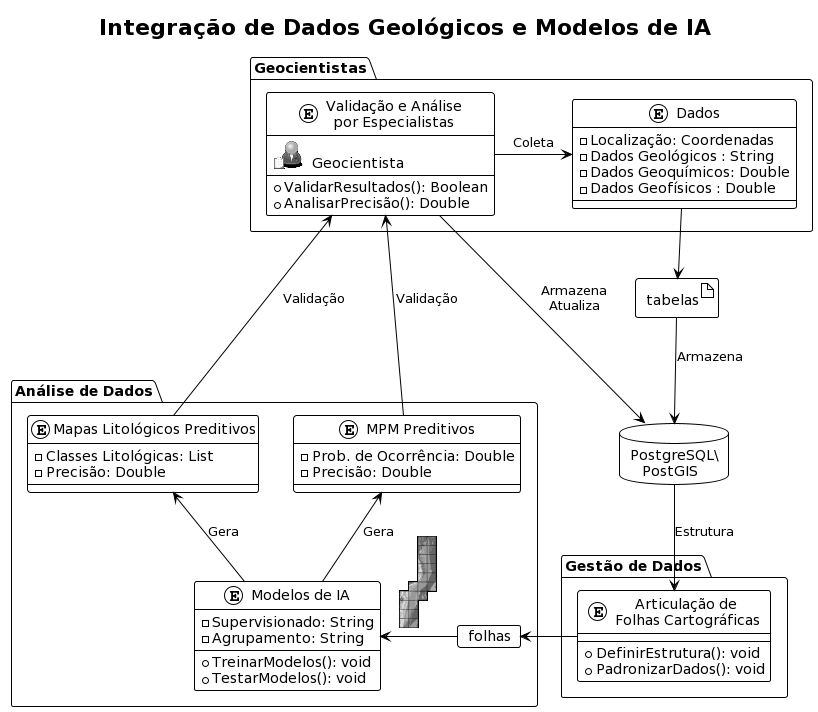

# Preditor Terra

## Sobre o Projeto

Projeto que visa a produção de um sistema dinâmico de produção de mapas
preditivos, no qual, ao se disponibilizar novos dados, novas predições serão
geradas.



## Por que usar uma base de dados relacional?

### Testando a performance de consultas espaciais
```
geodatabase=# EXPLAIN ANALYZE
SELECT * FROM folhas_cartograficas
WHERE ST_Intersects(wkb_geometry, ST_MakeEnvelope(-48.234, -10.939, -47.850, -10.469, 4326));
                                                                                                                      QUERY PLAN

---------------------------------------------------------------------------------------------------------------------------------------------------------------------------------
----------------------------------------------------------------------
 Bitmap Heap Scan on folhas_cartograficas  (cost=4.40..248.03 rows=15 width=146) (actual time=0.149..0.261 rows=96 loops=1)
   Filter: st_intersects(wkb_geometry, '0103000020E61000000100000005000000CBA145B6F31D48C054E3A59BC4E025C0CBA145B6F31D48C0E3A59BC420F024C0CDCCCCCCCCEC47C0E3A59BC420F024C0CDCCCCC
CCCEC47C054E3A59BC4E025C0CBA145B6F31D48C054E3A59BC4E025C0'::geometry)
   Heap Blocks: exact=45
   ->  Bitmap Index Scan on ix_folhas_cartograficas_geom  (cost=0.00..4.39 rows=15 width=0) (actual time=0.125..0.125 rows=96 loops=1)
         Index Cond: (wkb_geometry && '0103000020E61000000100000005000000CBA145B6F31D48C054E3A59BC4E025C0CBA145B6F31D48C0E3A59BC420F024C0CDCCCCCCCCEC47C0E3A59BC420F024C0CDCCCCCC
CCEC47C054E3A59BC4E025C0CBA145B6F31D48C054E3A59BC4E025C0'::geometry)
 Planning Time: 0.240 ms
 Execution Time: 0.285 ms
(7 linhas)
```
### Testando a eficiência de consultas espaciais sem uso de índices
```

geodatabase=# SET enable_seqscan TO OFF;
SET enable_indexscan TO OFF;
SET enable_bitmapscan TO OFF;

EXPLAIN ANALYZE
SELECT * FROM folhas_cartograficas
WHERE ST_Intersects(wkb_geometry, ST_MakeEnvelope(-48.234, -10.939, -47.850, -10.469, 4326));
SET
SET
SET
                                                                                                                      QUERY PLAN

---------------------------------------------------------------------------------------------------------------------------------------------------------------------------------
----------------------------------------------------------------------
 Bitmap Heap Scan on folhas_cartograficas  (cost=10000000004.40..10000000248.03 rows=15 width=146) (actual time=10.291..10.439 rows=96 loops=1)
   Filter: st_intersects(wkb_geometry, '0103000020E61000000100000005000000CBA145B6F31D48C054E3A59BC4E025C0CBA145B6F31D48C0E3A59BC420F024C0CDCCCCCCCCEC47C0E3A59BC420F024C0CDCCCCC
CCCEC47C054E3A59BC4E025C0CBA145B6F31D48C054E3A59BC4E025C0'::geometry)
   Heap Blocks: exact=45
   ->  Bitmap Index Scan on ix_folhas_cartograficas_geom  (cost=0.00..4.39 rows=15 width=0) (actual time=0.161..0.161 rows=96 loops=1)
         Index Cond: (wkb_geometry && '0103000020E61000000100000005000000CBA145B6F31D48C054E3A59BC4E025C0CBA145B6F31D48C0E3A59BC420F024C0CDCCCCCCCCEC47C0E3A59BC420F024C0CDCCCCCC
CCEC47C054E3A59BC4E025C0CBA145B6F31D48C054E3A59BC4E025C0'::geometry)
 Planning Time: 0.211 ms
 JIT:
   Functions: 2
   Options: Inlining true, Optimization true, Expressions true, Deforming true
   Timing: Generation 0.182 ms, Inlining 0.572 ms, Optimization 5.013 ms, Emission 4.511 ms, Total 10.279 ms
 Execution Time: 10.686 ms
(11 linhas)

```

## Estrutura do Repositório
O Repositório está estruturado em 4 caminhos principais:

```
~/projetos/PreditorTerra/..
+-- docs
+-- dotfiles
+-- jupyternotebooks
+-- source
+-- install.sh
+-- README.md
```

- [docs](https://github.com/Gabriel-Goes/mapeamento_litologico_preditivo/tree/main/docs) -- Documentos que fornecem informações sobre o projeto, assim
como relatórios de pesquisa, resumos e pôsters de eventos.
- [dotfiles](https://github.com/Gabriel-Goes/mapeamento_litologico_preditivo/tree/main/dotfiles) --  Arquivos de configuração do ambiente de programação, como
o environment.yml que serve para configurar o ambiente virutal do python com
conda, e o arquivo requirements.txt para configurar o ambieten virtual com
pyenv diretamente. (~~Recomendável~~)
- [jupyternotebooks](https://github.com/Gabriel-Goes/mapeamento_litologico_preditivo/tree/main/jupyternotebooks) -- Scripts de tutoriais e teste de código.
- [source](https://github.com/Gabriel-Goes/mapeamento_litologico_preditivo/tree/main/source) -- Código fonte do programa Preditor Terra.

## Instalação
Siga os passos abaixo para criar um diretório e clonar o repostiório do git.
```bash
# Crie uma pasta para nosso projeto para garantir organização
mkdir -p $HOME/projetos/PreditorTerra
cd $HOME/projetos/PreditorTerra

# Clone o repositório e siga para o diretório
git clone https://github.com/Gabriel-Goes/mapeamento-litologico-preditivo.git PreditorTerra
cd PreditorTerra
```
Execute o script [intsll.sh](https://github.com/Gabriel-Goes/mapeamento-litologico-preditivo/tree/main/install.sh)
para criar um ambiente virtual com [venv](https://docs.python.org/3/library/venv.html).
```
# Habilitando modo execução do arquivo
chmod +x ./install.sh
./install.sh
```
<span style="font-size:smaller;">_Este processo deve ser facilitando no futuro utilizando [docker]()_</span>
<span style="font-size:smaller;">_Ou refatorando a interface de TKinter para PyQT e adicioanndo ao QGIS como um plugin_</span>


## Uso
```
./PreditorTerra
```

## Catálogos STAC priorizados

Os endpoints STAC usados pelo pipeline ficam em `codes/config.py` na
estrutura `DEFAULT_STAC_CATALOGS`. Cada item define:

- `name`: rótulo descritivo do catálogo.
- `url`: endpoint STAC.
- `collections`: lista de coleções a consultar.
- `priority`: ordem de preferência (1 = maior prioridade).
- Metadados auxiliares como `preferred_assets` (ex.: `VNIR`/`SWIR`) e
  `cloudmask_assets`.

Para alterar a ordem ou incluir um novo provedor, ajuste essa lista ou
apontar a variável de ambiente `STAC_CATALOGS_FILE` para um JSON/YAML
com o mesmo formato. Exemplo de entrada:

```yaml
aster:
  - name: "ASTER AST_L1T (Planetary Computer)"
    url: "https://planetarycomputer.microsoft.com/api/stac/v1"
    collections: ["aster-l1t"]
    priority: 1
    preferred_assets: ["VNIR", "SWIR"]
    cloudmask_assets: ["CLOUDMASK", "QA"]
```

O pipeline tenta os catálogos em ordem de `priority` e escolhe o
primeiro que retornar cenas com VNIR, SWIR e máscara de nuvem válidas.

## Seleção rápida de ASTER via linha de comando

O script `codes/aster_pipeline.py` executa a busca e o ranqueamento
das cenas ASTER para uma folha cartográfica, priorizando cobertura,
baixa nuvem no recorte e proximidade temporal em relação à
`data_aerogama`.

### Exemplo de uso

```bash
cd codes
python aster_pipeline.py SB21_ZA_II2_NE 2008-06-01 \
  --search-window "2000-01-01/2020-12-31" \
  --min-coverage 0.98 \
  --max-local-cloud 0.01 \
  --output-json resultados/aster_SB21_ZA_II2_NE.json \
  --output-csv resultados/aster_SB21_ZA_II2_NE.csv
```

A saída traz o melhor item e a lista ordenada, com campos como ID da
cena, data de aquisição, fração de nuvem no recorte, fração de
cobertura sobre a folha e distância em dias para a data fornecida.

## QGIS + PostgreSQL/PostGIS

Caminho operacional preferencial para uso diário:

- [docs/operacao/qgis_postgis_ssh_tunnel.md](./docs/operacao/qgis_postgis_ssh_tunnel.md)

Esse fluxo mantém o PostgreSQL/PostGIS escutando localmente no GeoServer
e libera o acesso do QGIS no laptop por túnel SSH.

Fluxo legado de QGIS remoto via X11:

- [docs/operacao/qgis_remoto_windows.md](./docs/operacao/qgis_remoto_windows.md)

## Autor
Gabriel Góes

## Licença
Este projeto é licenciado sob a GPL - veja o arquivo 'LICENÇA' para detalhes.

## Contato
Para mais informações, entre em contato pelo correio eletrônico gabrielgoes@usp.br

## Contribuições

Para Contribuir com este projeto basta enviar um pull request.
Será adicionado neste arquivo uma lista de frentes a serem desenvolvidas e necessitam de contribuição.

#### Contribuições de:

 - Hilo Góes

#### Apoio de:
 - Dr. Caetano Juliani
 - Victor S. Silva
 - Luiz Dutra
 - Rodrigo Brust
 - Vinicius A. Louro
